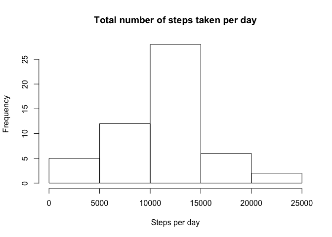
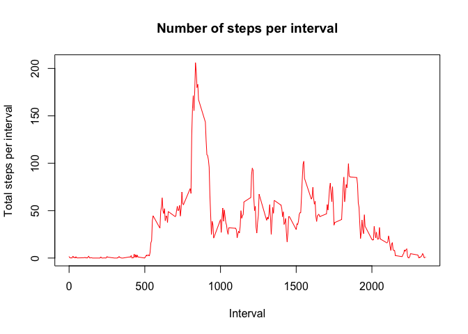
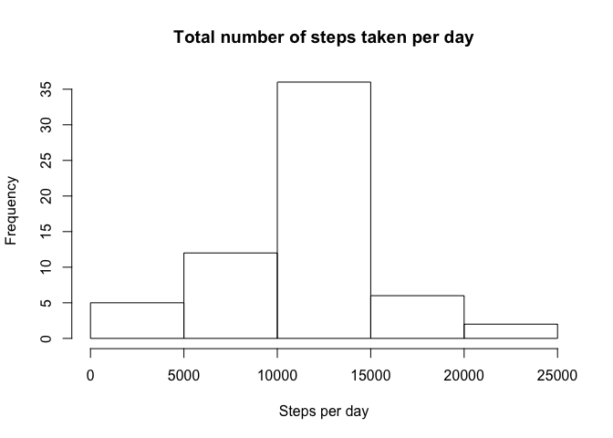
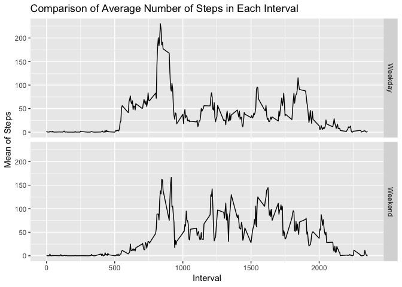

## Loading and preprocessing the data

Load the data, process/transorm it if necessary


```r
download.file("https://d396qusza40orc.cloudfront.net/repdata%2Fdata%2Factivity.zip", destfile = "activity.zip", mode="wb")

unzip("activity.zip")

raw_data <- read.csv("activity.csv")

head(raw_data)
```

```
##   steps       date interval
## 1    NA 2012-10-01        0
## 2    NA 2012-10-01        5
## 3    NA 2012-10-01       10
## 4    NA 2012-10-01       15
## 5    NA 2012-10-01       20
## 6    NA 2012-10-01       25
```


## What is mean total number of steps taken per day?
### 1. Total number of steps taken per day, ignoring the NA values


```r
act_step_day <- aggregate(steps ~ date, data=raw_data, FUN=sum, na.rm=TRUE)
```
### 2. Make a histogram of the total number of steps taken each day

```r
hist(act_step_day$steps, xlab="Steps per day", main="Total number of steps taken per day")
```

<!-- -->


###3. Calculate the Mean and Median of the total number of steps taken per day

```r
mean_step <- mean(act_step_day$steps)

mean_step
```

```
## [1] 10766.19
```

```r
median_step <- median(act_step_day$steps)

median_step
```

```
## [1] 10765
```


## What is the average daily activity pattern?
### 1. Make a time series plot (i.e type ="l" of the 5 minute interval(x-axis) and the average number of steps taken (y-axis)

```r
act_step_mean <- aggregate(steps ~ interval,data=raw_data, FUN=mean, na.rm=TRUE)
plot(act_step_mean$interval ,act_step_mean$steps, type="l", col="red", xlab="Interval", ylab="Total steps per interval",main="Number of steps per interval")
```

<!-- -->

### 2. Which 5 min interval, on average across all days in the data, contains the maximum number of steps


```r
max_step <- max(act_step_mean$steps)
head(max_step)
```

```
## [1] 206.1698
```

```r
max_intv <-act_step_mean$interval[which(act_step_mean$steps == max_step)]
max_intv
```

```
## [1] 835
```
## Imputing missing values
There are number of days/intervals where there are missing values in the data
### 1. Calculate and report the total number of missing values in the dataset


```r
missing_vals <- sum(is.na(raw_data))
```
### 2. Devise a strategy to fill the missing values in the dataset. The Fill it with mean for that 5 min interval.


```r
library(magrittr)
library(dplyr)
```

```
## 
## Attaching package: 'dplyr'
```

```
## The following objects are masked from 'package:stats':
## 
##     filter, lag
```

```
## The following objects are masked from 'package:base':
## 
##     intersect, setdiff, setequal, union
```

```r
repl_with_mean <- function(x) replace(x,is.na(x),mean(x,na.rm=TRUE))
```
### 3. Create a new dataset that is equal to the original datset but with the missing data filled in


```r
meandata <- raw_data %>% group_by(interval) %>% mutate(steps=repl_with_mean(steps))
head(meandata)
```

```
## # A tibble: 6 x 3
## # Groups:   interval [6]
##    steps date       interval
##    <dbl> <fct>         <int>
## 1 1.72   2012-10-01        0
## 2 0.340  2012-10-01        5
## 3 0.132  2012-10-01       10
## 4 0.151  2012-10-01       15
## 5 0.0755 2012-10-01       20
## 6 2.09   2012-10-01       25
```

```r
imp_act_step_day <- aggregate(steps ~ date, data=meandata, FUN=sum)
```

### 4. Make a Histogram of the total number of steps taken each day and calculate and report the mean and median total number of steps taken per day. Do these values differ from the estimates from the first part of the assignment? What is the impact of imputing missing data on the estimates of the total daily number of stpes? 


```r
hist(imp_act_step_day$steps, xlab="Steps per day", main="Total number of steps taken per day")
```

<!-- -->

###Mean and median of imputed and original dataset

Mean of imputed dataset:

```r
imp_mean_step <- mean(imp_act_step_day$steps)
imp_mean_step
```

```
## [1] 10766.19
```
Mean of original dataset:

```r
mean_step
```

```
## [1] 10766.19
```
Median of imputed dataset:


```r
imp_median_step <- median(imp_act_step_day$steps)
imp_median_step
```

```
## [1] 10766.19
```

Median of original dataset:

```r
median_step
```

```
## [1] 10765
```
COMPARISON:

From the comparison, we can see that means were same and medians of each dataset are slightly different


## Are there differences in activity patterns between weekdays and weekends?
### 1. create a new factor variable with two levels: weekday and weekend

```r
meandata$WeekendOrWeekday <- ifelse(weekdays(as.Date(meandata$date)) %in% c("Monday","Tuesday","Wednesday","Thursday","Friday"),"Weekday","Weekend")
meandata <- (meandata %>% group_by(interval, WeekendOrWeekday) %>% summarise(Mean = mean(steps)))
```
###Make a panel plot containing a time series plot  (i.e. type="l") of the 5-minute interval (x-axis) and the average number of steps taken, averaged across all weekday days or weekend days (y-axis).

```r
library(ggplot2)
ggplot(meandata, mapping = aes(x = interval, y = Mean)) + geom_line() +
       facet_grid(WeekendOrWeekday ~.) + xlab("Interval") + ylab("Mean of Steps") +
       ggtitle("Comparison of Average Number of Steps in Each Interval")
```

<!-- -->


We see that there are differences in activity patterns between weekdays and weekend. Compared with weekdays, people tend to get up late and stay up late on weekends.
